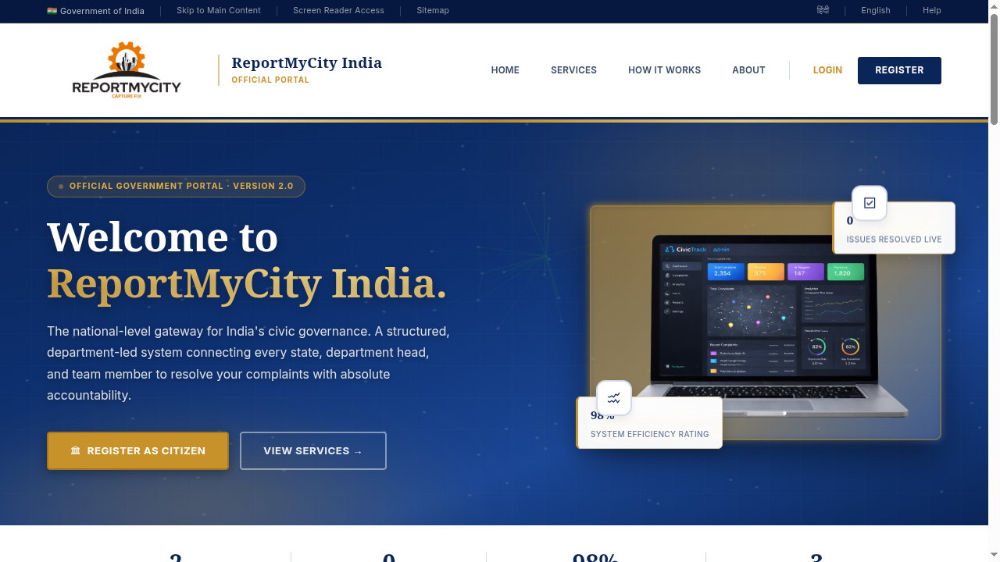
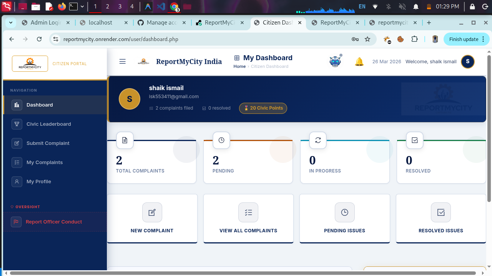
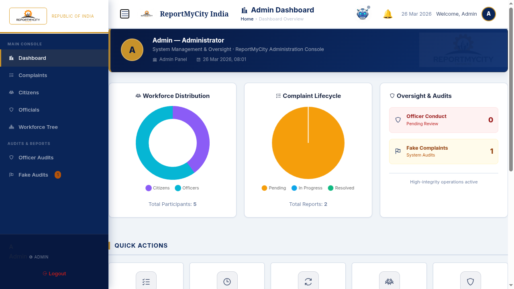
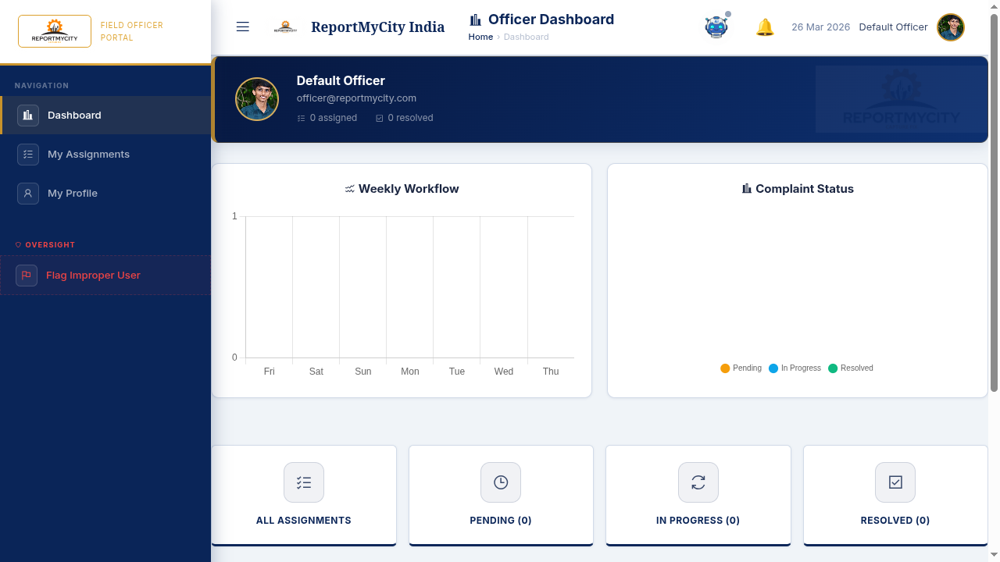

# 🏛️ ReportMyCity India (V2.0)
### *Empowering Citizens through Digital Accountability*

**ReportMyCity** is a premium, national-level governance portal designed to bridge the gap between citizens and local authorities in India. It provides a structured, department-led system for reporting civic issues, tracking resolutions, and ensuring administrative oversight with a high-integrity auditing system.

---

## 📸 Platform Overview

### 🌍 Official Landing Page
Modern, responsive, and secure gateway for all Indian citizens to engage with their local government.


### 👤 Citizen Dashboard
Empowering citizens to report issues like road damage, garbage, or misconduct. Includes gamified progress through "Civic Points" and "Levels."


### 🛡️ Administrative Console
Comprehensive oversight for National, State, and District Admins. Includes workforce distribution analytics, complaint lifecycles, and audit logs.


### 👮 Field Officer Portal
Dedicated interface for officers to receive assignments, track locations, and provide verified proof of resolution.


---

## 🔥 Key Features

- **Multi-Tier Administration:** Hierarchical access for Local, District, State, and National administrators.
- **Smart Complaint Routing:** Automated assignment based on regional jurisdiction and department expertise.
- **Gamification System:** Encourages citizen participation with "Civic Points," "Levels," and "Hero Badges."
- **Integrity Audits:** Dedicated modules for reporting officer misconduct and flagging fake complaints.
- **Real-Time Notifications:** Instant alerts for status changes, new assignments, and administrative actions.
- **Google OAuth Integration:** Secure, one-click sign-in for citizens.

---

## 🛠️ Technology Stack

- **Backend:** PHP 8.4 (Standalone with Apache)
- **Database:** MongoDB (NoSQL) for high-flexibility data architecture
- **Frontend:** HTML5, CSS3 (Custom Variables System), Vanilla JavaScript
- **Email:** PHPMailer (SMPT Integration)
- **Containerization:** Docker & Docker Compose
- **Hosting:** Optimized for Render / VPS Deployment

---

## 🚀 One-Command Deployment

This project is fully containerized. To launch the entire stack on your local machine:

```bash
# Clone the repository
git clone https://github.com/YourUsername/ReportMyCity.git
cd ReportMyCity

# Start the environment
docker-compose up -d --build

# Install dependencies (First time only)
docker-compose exec app composer install
```

The portal will be live at `http://localhost`.

---

## 🗄️ Database Architecture
The project uses **MongoDB** with five core collections:
1. `users`: Citizen profiles and gamification stats.
2. `admins`: Administrative hierarchy and access logs.
3. `officers`: Field workforce database and task history.
4. `complaints`: The core workflow data (statuses, photos, locations).
5. `notifications`: System-wide registry for real-time alerts.

---

## 🇮🇳 MISSION
**ReportMyCity** is built to foster transparency and efficiency in India's civic governance, ensuring that every citizen's voice is heard and every issue is resolved with absolute accountability.
